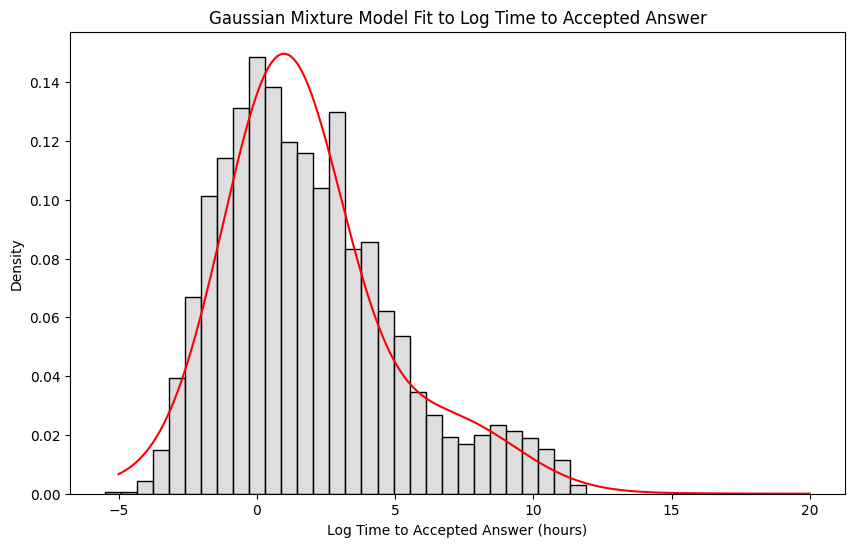
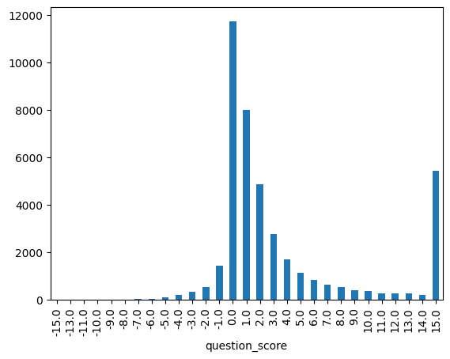

#  The Data

The analysis is based on a dataset comprising of **100,000 questions** extracted from the StackExchange platform (StackOverflow) using StackExchange API. The aim was to get to know the data characteristics and see what challenges may arise during modeling as well as what in particular can be predicted from the textual content.

## Data Characteristics and Preprocessing

The raw dataset contained eleven distinct features covering textual content, metrics, and acceptance status:

| #   | Column                              | Type       |
| :---| :-----------------------------------| :----------|
| 0   | `title`                             | `string`   |
| 1   | `has_accepted_answer`               | `bool`     |
| 2   | `accepted_answer_score`             | `float64`  |
| 3   | `time_to_accepted_answer_hours`     | `float64`  |
| 4   | `question_score`                    | `int64`    |
| 5   | `question_text`                     | `string`   |
| 6   | `num_tags`                          | `int64`    |
| 7   | `tags`                              | `string[]` |
| 8   | `accepted_answer_id`                | `float64`  |
| 9   | `accepted_answer_length_chars`      | `float64`  |
| 10  | `accepted_answer_length_tokens`     | `float64`  |

Initial data hygiene involved dropping 8 duplicate questions identified by their ID.

## Analysis of Answer Metrics and Sparsity

A crucial finding from the exploratory data analysis (EDA) was the significant sparsity in the answer-related features:

*   A total of 39,938 questions had an accepted answer, while 60,054 did not.
*   However, only **12,000** of these accepted answers had non-null values for temporal metrics.

Analysis of the `time_to_accepted_answer_hours` for this small subset revealed that the distribution, when log-transformed, exhibited a multimodal structure. This suggests that answers are accepted across different temporal regimes, possibly corresponding to simple versus complex problems, or different subject areas ([@fig:gmm-acc-ans]).

{#fig:gmm-acc-ans width=60%}

This result led to the conclusion that answer-based analysis was challenging due to the lack of sufficient data points with defined accepted answer characteristics. Scraping more data, just to analyze only a fraction of questions seemed infeasible, that's why we dropped this idea.

## Tag Cardinality and Filtering

The raw dataset contained an excessively large vocabulary of **22,753 unique tags**. The top five most frequent initial tags were `python` (1528), `c#` (746), `javascript` (703), `c++` (689), and `java` (592).
For simplicity sake, we initially focused on the 7,684 most frequent tags.
The majority of questions in this subset had only one tag (38,547), although multi-label instances were present (3,015 questions had 2 tags; 464 had 3).

To create a manageable feature space for initial classification attempts, two approaches were considered:

1.  **Frequency-Based Filtering:** Limiting the analysis to the most popular programming languages (e.g., Python, C#, Java). This approach resulted in a subset of 42,037 questions tagged with a set of 9 popular programming languages.
2.  **Semantic Clustering:** Using high-dimensional embeddings and clustering algorithms to group semantically similar tags.

{#fig:tag-freq width=60%}

After a preliminary analysis, the second approach was chosen to retain semantic richness while reducing dimensionality and making the challenge more fun and interesting.

## Question Score Distribution

The raw scores (`question_score`) ranged widely from -20 up to 27,487. The score distribution was heavily skewed around zero ([@fig:score-dist]). We considered grouping this continuous variable into five classes of uneven frequencies:

*   **Bad:** $(-\text{inf}, -1]$
*   **Neutral:** $0$
*   **Good:** $(1, 3]$
*   **Very Good:** $(3, 20]$
*   **Excellent:** $(20, \text{inf})$
  
But ultimately, the decision was made to treat score prediction as a regression problem to preserve the granularity of the data.

{#fig:score-dist width=60%}

## Data gathering summary

Finally, we retained the following columns for further analysis:

-  `title` (textual content)
-  `question_text` (textual content)
-  `tags` (target for classification)
-  `question_score` (target for regression)

The final version of the dataset contained **99 992 unique questions**.
