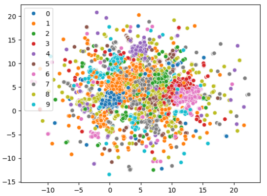
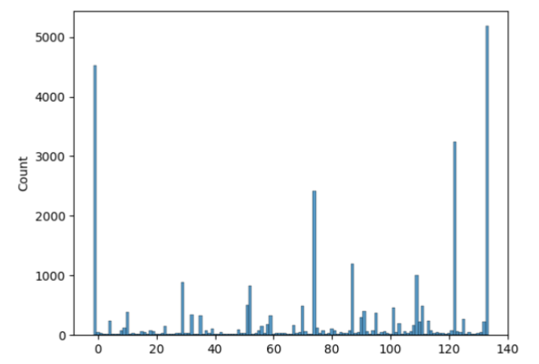
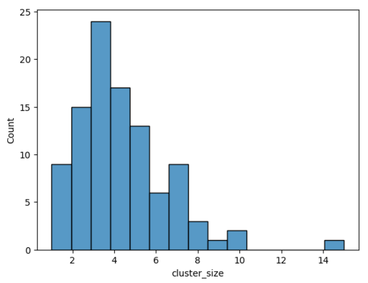

# The Methodologies

The path to generating robust predictive models required significant methodological investment, particularly in handling the immense size and complexity of the embedded text data.

## Embedding Generation

Textual data (titles and question bodies) was transformed into **4096-dimensional vectors** using the open-source embedding model **`qwen3-embedding:8b`**.

Initial efforts to leverage transformer tokenization for sequence-aware embeddings quickly proved computationally prohibitive, necessitating a fallback to simpler pooled embeddings (mean pooling) due to projected processing times exceeding 40 hours. Furthermore, during the embedding process, **147 samples were found to be corrupted** (containing NaN or Infinite values), which required a dedicated remediation process involving reloading the base model and clamping the generated embeddings to a safe float16 range before storage.

## Dimensionality Reduction and Clustering

The high dimensionality (4096 dimensions) and high cardinality (22,753 unique tags) presented immediate barriers to traditional clustering techniques. As we still wanted to retain semantic richness in the tag space, we explored various dimensionality reduction and clustering strategies.

### Initial tries (HDBSCAN and UMAP)

1.  **HDBSCAN (Hierarchical Density-Based Spatial Clustering of Applications with Noise)** was initially rejected because memory requirements exceeded the available 64GB of RAM.
2.  **UMAP (Uniform Manifold Approximation and Projection)** was adopted as a non-linear dimension reduction technique (e.g., reducing to 5 components), coupled with HDBSCAN clustering. Optimization of UMAP and HDBSCAN parameters was attempted using **Optuna**, guided by unsupervised metrics like the Caliński-Harabasz index, Silhouette score, and Cluster persistence.

This combined approach failed to yield coherent results. The clusters were highly imbalanced, with large numbers of points assigned to a single noise cluster or small, trivial clusters (visible in [@fig:naive-umap] and [@fig:labels-umap-hdbscan]). This failure was theorized to stem from the violation of UMAP’s underlying assumption that data should be uniformly distributed on a Riemannian manifold, as dense embeddings often exhibit varying local geometry.

{#fig:naive-umap width=60%}

{#fig:labels-umap-hdbscan width=60%}

### Recursive Spherical K-Means Clustering

To achieve a stable reduction of the tag space to **100 semantic centroids**, a **Recursive Embedding and Clustering (REAC)** approach, inspired by industry techniques, was implemented.

1.  **Tag Filtration:** Tags with a low frequency (threshold $< 100$) were initially removed, resulting in a dataset reduced to **411 unique tags** across 90,205 records.
2.  **Clustering:** **Recursive Spherical K-Means** was employed on these 411 tags. Spherical K-Means is particularly advantageous for textual embeddings as it optimizes distance based on **cosine similarity**. This process successfully yielded the target 100 centroids. Unlike in the case with HDBSCAN, this time the resulting clusters showed a stable distribution of tags per centroid [@fig:cluster-sizes-per-centroid] and focused on general ideas connecting the grouped tags, e.g.: the cluster that could have been described as "databases" included: `database`, `mongodb`, `sql`, `postgresql`, `mysql`, etc..
3.  **Orphan Assignment:** The 9,787 infrequent "orphan tags" were assigned to their nearest centroid based on cosine similarity, ensuring that all 22,753 original tags were mapped to the final 100 classes.

{#fig:cluster-sizes-per-centroid width=60%}
