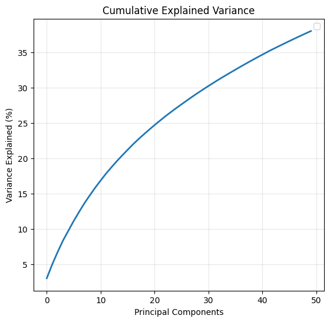
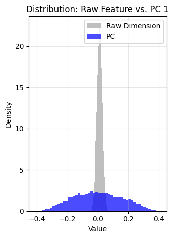

# The Methodologies

The path to generating robust predictive models required significant methodological investment, particularly in handling the immense size and complexity of the embedded text data.

## Embedding Generation

To transform the textual data (titles, tags, and question bodies) into numerical feature representations, we utilized **`qwen3-embedding:8b`**, an open-source model capable of generating **4096-dimensional vectors** [@qwen_embedding].
Textual data (titles and question bodies) was transformed into **4096-dimensional vectors** using the open-source embedding model **`qwen3-embedding:8b`**.

We implemented two distinct embedding strategies:

### Global Document Embedding (Baseline)

- This approach served as the baseline due to its simplicity and relative computational speed.
- Embed each question body, title and tag individually into an embedding vector.
- This method assumes that the semantic context of the entire document can be effectively compressed into a single 4096-dimensional vector (using `float64` precision) without significant information loss.
- Computation required approximately 6 hours using the `ollama` library [@ollama]. The resulting dataset occupied 3.3 GB of storage.

### Sequential Token Embedding {#seq-embedding}

- To address potential information loss in the baseline approach, we hypothesized that a single vector might fail to capture complex dependencies in longer texts.
- Instead of pooling the text into one vector, we maintained a sequence of embeddings to preserve token-level knowledge. We defined a fixed sequence length of 4 tokens for the title and 32 tokens for the body, resulting in a distinct embedding vector for each token.
- Implementation changes:
- Due to the limitations of `ollama` in the terms of appropriate tokenizer for our model, as well as inefficient resource management during embedding, we've switched to *Hugging Face* `transformers` library.
    - Because of the exponential increase in data size and compute time, we reduced the floating-point precision from `float64` $\to$ `float32`.
- These optimizations reduced the estimated compute time from 40 hours to approximately 13 hours.
- The resulting embeddings required 27 GB of space. Due to memory constraints preventing the dataset from being loaded entirely into RAM, we utilized the Hierarchical Data Format (HDF5) for efficient storage and access [@hdf5].

## Embedding Analysis

After the embedding phase, we wanted to verify the validy of the topology and density of the resulting embedding space. Specifically, we wanted to verify that the embeddings captured sufficient semantic overlap between questions to facilitate meaningful clustering. 

To measure this, we analyzed the *Nearest-Neighbour Cosine Similarity*. Using a
subset of the question embeddings, we performed the following steps:

- Normalized the embeddings (the resulting embeddings from `ollama`
theoretically should be normalized, but it's better to normalize it anyway,
since it does not affect the data).
- We utilized the `NearestNeighbors` algorithm (from `scikit-learn`) to locate the closest non-identical neighbor ($k=1$) for each data point.
- We calculated the cosine similarity for these pairs, defined as $1 - \text{cosine\_distance}$.

{#fig:tags-nn-cosine-sim width=60%}

As we can see in Figure [@fig:tags-nn-cosine-sim], the distribution of nearest-neighbor similarities is approximately Gaussian and centered around 0.65.

- The lack of data points near 0.0 indicates that very few questions are "isolated" in the vector space; almost every question has a semantically related counterpart.
- The unimodal distribution suggests a well-structured manifold where local neighborhoods are consistent. This confirms that the embedding model (`qwen3-embedding`) successfully mapped semantically similar questions to adjacent regions in the high-dimensional space, providing a strong foundation for the subsequent clustering phases.

\newpage

# Tag Dimensionality Reduction and Clustering

The tag space presents two major challenges: high dimensionality (4096-dimensional embeddings) and high cardinality (22,753 unique tags). These properties make traditional clustering methods difficult to apply directly. Because we aimed to preserve as much semantic structure as possible, we investigated several dimensionality reduction and clustering strategies.

### HDBSCAN  

HDBSCAN (Hierarchical Density-Based Spatial Clustering of Applications with Noise) [@hdbscan] was initially considered, due to its ability to identify clusters of varying density and to naturally model noise. However, the method proved infeasible at our scale. During graph construction, the algorithm attempted to allocate a dense distance matrix, resulting in more than 64 GB of RAM usage:

```shell
MemoryError: Unable to allocate 74.5 GiB for an array with shape (99992, 99992) and data type float64
```

Even incorporating Birch pre-clustering [@Zhang1997], which is often recommended to reduce memory footprint, did not sufficiently mitigate these requirements.

### UMAP

Given its popularity for high-dimensional manifold learning and its strong community reports, particularly its successful use in document embedding tasks such as the [20 Newsgroups dataset](http://qwone.com/~jason/20Newsgroups/), we next explored UMAP (Uniform Manifold Approximation and Projection) [@mcinnes2020umapuniformmanifoldapproximation] as a potential solution.
Encouraged by these findings, following community best practices, we tested two approaches:
    
- Single stage with 'pure' UMAP
- Two-stage with PCA $\rightarrow$ UMAP

The rationale for the second approach comes from the UMAP’s reliance on pairwise distances when constructing its topological graph. In very high-dimensional spaces, distance measures tend to concentrate, causing points to appear nearly equidistant. Applying PCA first captures the dominant variance structure and reduces sparsity effects before manifold learning.

For the single stage approach, we applied UMAP directly to the 4096-dimensional vectors using the cosine metric (appropriate given that the underlying embeddings were already normalized thanks to `ollama`). Reducing directly to two dimensions produced the projection shown in [@fig:naive-umap], which exhibited significant overlap and very poor global structure.

{#fig:naive-umap width=60%}

After brief hyperparameter search using optuna, we've decided to scrap the
single-stage approach, in favor of the two-stage one.

As the first stage, PCA was picked as the best candidate, due to it's variance
maximization, relative simplicity, and little computation overhead.

### Optuna hyperparameter search

To improve UMAP’s performance, we conducted a hyperparameter search using Optuna [@optuna_2019].
For optimization, a suitable objective function was required. We first experimented with the Calinski–Harabasz index [@Calinski01011974], but due to its tendency to assign inflated scores to degenerate solutions (e.g., one or two dense clusters), we replaced it with a weighted combination of:

- Silhouette Score
- Calinski-Harabasz score
- Custom penalty for generating clusters with very few points.

We tested both a flat optimization procedure and a nested one. In the nested variant, the outer loop optimized PCA hyperparameters, and the inner loop optimized UMAP parameters conditioned on the PCA output.

Neither approach produced coherent clustering. The resulting label distributions ([@fig:labels-umap-hdbscan]) were dominated by either a large noise cluster or numerous trivial micro-clusters. This instability pointed to deeper issues in the reduction pipeline:

- The evaluation metrics themselves were insufficiently sensitive to the structure we hoped to recover.
- Available compute limited the ability to explore more.
- Most importantly, the underlying assumptions of UMAP were violated:
    - UMAP assumes the data is sampled from a uniformly distributed Riemannian manifold, but dense embedding spaces often exhibit highly non-uniform local geometry.

{#fig:labels-umap-hdbscan width=60%}

\newpage

#### Variance Loss in PCA \newline

A more fundamental limitation emerged when examining the PCA stage itself. To measure how much information a PCA stage would discard, we computed the explained variance on a representative sample of 10,000 embeddings. The results revealed that the embedding space is extremely flat: the first principal component alone explains a negligible fraction of the variance, and adding more components yields slow, sublinear improvement. Even with the top 50 PCs, only 38% of the total variance is recovered. This behavior is illustrated in [@fig:pca-variance].

{#fig:pca-variance width=40%}

This structure is also visible when comparing the distribution of a raw embedding dimension to the distribution of the first principal component. As shown in [@fig:pca-distribution], a random raw dimension is tightly concentrated around zero, indicating very low variance. In contrast, $\text{PC}_1$ has a much broader distribution, reflecting the fact that most of the meaningful variance in the data collapses.

{#fig:pca-distribution width=30%}

To reiterate, metric limitations, computational constraints, and mismatches between the UMAP's assumptions and the geometry of dense embedding space, combined with the extensive optuna hyperparameter search, for which the best candidate identified by the optimization process, the PCA alone discarded approximately 62% of the variance present, motivated us to search for different approach to dimensionality reduction.


### Recursive K-Means Clustering

Our initial approach was inspired by methodologies for hierarchical data organization, such as those described in engineering blogs by [Spotify](https://engineering.atspotify.com/2023/12/recursive-embedding-and-clustering) dealing with large-scale recommendation systems. We designed a Recursive K-Means Clustering algorithm to structure the tags into a navigable tree.

The core concept involves recursively partitioning the tag embedding space. Starting with the root node containing all tags, we apply K-Means to split the data into k clusters. This process is repeated for each resulting cluster until a maximum depth is reached or a cluster becomes too small to split further. For this algotithm, we've relied on Euclidean distance.

The big difference from the previous algorithms is that we do not reduce the
data itself, but rather **find the best representation for the predefined amount
of classes**. 

| Tag | closest_dist | cluster_mean | tag_embedding | cluster_size | top_5_popular_tags |
| :--- | :--- | :--- | :--- | :--- | :--- |
| facebook | 0.089584 | [0.004879954, $\ldots$] | [0.002688237, ...] | 94 | [instagram-api, instagram, ...] |
| integer | 0.040206 | [0.027635492, ...] | [0.03159611, ...] | 370 | [intervals, differential-equations, ...] |
| storage | 0.105308 | [0.008282, ...] | [0.020607475, ...] | 134 | [dicomweb, remotestorage, ...] |
| tf-idf | 0.070302 | [0.027263727, ...] | [0.024365697, ...] | 243 | [wpml, locale, ...] |
| qt | 0.074746 | [0.01614129, ...] | [0.016203284, ...] | 106 | [qt, qml, pyqt, qasync, qt6] |

### Recursive Spherical K-Means Clustering

While effective for spatial data, Euclidean distance is often suboptimal for
high-dimensional semantic embeddings, where the direction of the vector
typically encodes more semantic meaning than its magnitude. That's why, to better capture the semantic relationships between tags, we evolved our approach to Recursive Spherical K-Means Clustering [@JSSv050i10]. This variation partitions the data by minimizing the cosine dissimilarity rather than the Euclidean distance, effectively clustering data points on the surface of a hypersphere (hence, the spherical in Spherical K-Means).

#### Implementation Details \newline

After investigating the tag frequency in our dataset, we've decided to impute
all tags, which occured less frequent than 100 times. This resulted in 411
unique tags and in 90205 questions whith tag.
This operation did not changed the overall characteristic of the dataset as we
can see in the [@fig:tag-per-q]

{#fig:tag-per-q height=25%}

With the orphan quesions (the ones without tags), we assigned them to the
nearest embedding based on the cosine similarity of their tag.

For example:

```python
closest_centroid_tag(tags,centroid_tags, 'ntp')
('datetime', np.float64(0.8098148848579392))
```

We implemented a custom SphericalKMeans estimator compatible with the *scikit-learn* API. The algorithm enforces unit-norm constraints on both the input data and the cluster centroids during optimization. The update steps were optimized following the algorithms described by [@Schubert_2021].

Our implementation include:

- Unit Normalization
- Cosine Similarity maximization:
    - The core objective is to maximize the summation of cosine similarities
    between samples and their assigned centroids.
- The algorithm returns a tree structure. The root node contains all tag embeddings; the next level (depth 1) contains the target centroids (100 in our case); subsequent levels contain increasingly specific tag embeddings.
    - For all target tags, we calculated the mean and identified the 'most representative tag' (the tag closest to the cluster mean).

From this point forward, we refer to the clusters at depth 1 of the recursive tree as the clusters for simplicity sake.

## Reduction Analysis

The resulting clusters demonstrated strong semantic coherence. For example, for
the outlier centroid with most directly connected tags, the algorithm
effectively grouped database-related technologies:

- Cluster Centroid: `database`
- Members: `database`, `mongodb`, `sql`, `elasticsearch`, `firebase`, `postgresql`, `sqlite`, `mysql`, `jdbc`, `supabase`, `sql-update`, `redis`, `hibernate`, `sqlalchemy`, `snowflake-cloud-data-platform`

Similarly, we observed distinct clusters for front-end frameworks (grouping angular, vue.js, react), mobile development (android, flutter, ios), and scientific computing (pandas, numpy, python).

Another impressive result of this reduction is its ability to classify question embeddings solely based on cosine similarity. 
As an example, we evaluated how well the model classifies the `.net` tag. We computed the cosine similarity between a given question and each cluster, selecting the two closest clusters. We then computed a confusion matrix based on the presence of `.net` in the ground-truth question tags, which yielded the results in [@fig:cm-results1].

{#fig:cm-results1 width=40%}

Based on this functionality, we've made a basic model `DualEncoderMatcher`,
which classifies tags based on cosine similarity mentioned above.

As an experiment, we took random question and checked 5 most similar clusters to
it:

- Question:
```text
'I am new to pandas library in python. When I loaded a file and was printing the output of df.info into console, the data ...'
```
- Result:
```python
Top 5 predictions: [('python', np.float64(0.38295367797329094)), ('word-table', np.float64(0.3696944707340029)), ('ironpdf', np.float64(0.3647400168217892)), ('django', np.float64(0.3297345619706671)), ('apache-spark', np.float64(0.3283243442282066))]
```

These experiments demonstrated the semantic power held by these clusters and prompted us to move towards prediction.
