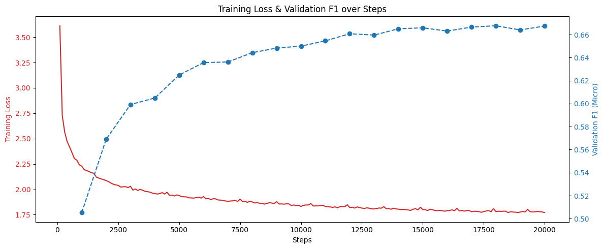

# The Experiments

##  Tag Prediction

The primary classification goal was to predict the appropriate semantic tag centroid(s) for a given question using its 4096-dimensional body embeddings.

### XGBoost Baseline

As a baseline, an XGBoost [@Chen_2016] model was trained on question body embeddings. To simplify the initial evaluation, the inherently multi-label task was reduced to a multiclass classification problem. The target for each question was mapped to a single label via a majority vote mechanism, selecting the centroid (or tag group) containing the highest frequency of the question’s original tags.

This XGBoost model trained for 599 minutes. It achieved a **Weighted F1 Score of 0.6882** (and accuracy of 0.6928). The limitation of this approach was its inability to effectively model the complex, non-linear semantic interactions embedded in the 4096-dimensional vectors, forcing it to treat the dimensions largely independently. Nevertheless, this result provided a solid benchmark for subsequent deep learning models.

{#fig:xgboost-cm width=85%}

### Neural Network Architectures

To improve baseline performance, several neural network architectures were explored to better capture the semantic relationships in the embeddings and to natively handle the multi-label nature of the task.

#### Simple MLP Baseline \newline

We implemented a baseline using a simple Multi-Layer Perceptron (MLP) trained on question body embeddings. Given the multi-label nature of the problem, where a single question may contain both popular tags (e.g., `python`) and rare tags (e.g., `darts`), we had to employ a loss function which takes it into consideration. Initially, we employed `BCEWithLogitsLoss`, which applies a binary cross-entropy loss independently to each class.

While `BCEWithLogitsLoss` is standard for multi-label tasks, it treats all negative labels equally. In a sparse setting where most tags are negative for any given sample, the easy negatives can overwhelm the training signal. Despite these limitations, the MLP baseline achieved a weighted F1 score of approximately 0.6790.
This reasonable performance confirmed the viability of the embedding approach but highlighted the need for richer architectures to capture the nuanced relationship between a question's title and its body.

{#fig:mlp-val width=75%}

#### Dual-Stream Fusion Network (DSF) \newline

To better leverage the distinct semantic information contained in titles and bodies, we developed a custom Dual-Stream Fusion (DSF) network, adapting the architecture proposed by Yang et al. for multi-modal fake news detection [@YANG2024112358].

##### Architecture 
The model processes the Title and Body embeddings through two separate streams. These streams are then integrated using a Multi-Head Self-Attention (MHSA) mechanism. The core idea is that the attention mechanism can dynamically weigh the importance of the title versus the body depending on the context. For instance, a short, distinct title might carry more weight than a long, vague body text.

##### Regularization and Overfitting
Initial training runs revealed significant overfitting. The model's validation performance rapidly deteriorated below the MLP baseline after only a few epochs. This demonstrated the "double-edged sword" of attention mechanisms: while they offer high expressivity, they allow the model to easily memorize the relatively small dataset of ~100k samples. Standard regularization techniques—such as increased dropout, weight decay, and aggressive learning rate schedulers—yielded limited success.

Notable improvement came from implementing a different loss function—`Assymetric Loss` (ASL)
[@benbaruch2021asymmetriclossmultilabelclassification].
In multi-label classification with many classes, the "negative" samples (tags
not present) vastly outnumber the "positive" ones. Standard Cross Entropy allows
these easy negatives to dominate the gradient, washing out the signal from the
rare positives. ASL addresses this by dynamically down-weighting easy negatives.
It introduces two focusing parameters, $\gamma_+$ and $\gamma_-$.
By setting $\gamma_- > \gamma_+$, ASL aggressively suppresses the loss
contribution from negative samples the model is already confident about. 
This forces the optimization process to focus on "hard" negatives (confusing tags) and positive samples, effectively handling the extreme class imbalance without manual re-weighting. 

We trained the optimized DSF model with `AdamW` optimizer, `ReduceLROnPlateau` scheduler, and ASL loss with $\gamma_- =4, \gamma_+ =1$ for
50 epochs, which resulted in F1 score (micro) on validation set of 0.713, and
weighted of 0.711.

{#fig:pt-sa width=60%}

As seen in [@fig:pt-sa], the use of a high $\gamma_-$ in ASL successfully
boosted recall for many classes. However, this comes with a trade-off: simply
increasing $\gamma_-$ indefinitely leads to an overemphasis on recall at the expense of precision.
This behavior indicates that while advanced loss functions can mitigate data imbalance, further performance gains likely require increasing the dataset size rather than just architectural tuning.

#### DSE with Cross-Attention Fusion \newline
*   To further combat overfitting and improve feature interaction, the MHSA was replaced with **Cross-Attention**, allowing the typically concise **Title embedding to "query" the verbose Body embedding** to extract relevant features.
*   Additional regularization, **Manifold Mixup**, was applied to the embeddings during training to encourage smoother decision boundaries in the latent space.
*   Trained over 100 epochs (~60 minutes) using OneCycleLR scheduling, this model achieved the best outcome: **F1 Micro 0.7253** and **F1 Weighted 0.7196**.

{#fig:dsf-performance height=95%}

#### Seq2Seq Model \newline

Instead of thinking about our task as a classification task, we could rephrase
is as a Sequence to Seqence problem, where we want to model one sequence
(question embedding) into another (tag(s) embedding(s)). 
This approach has the biggest potential out of all mentioned earlier, since we
can leverage the unprecedented rise of LLMs, by taking a pre-trained model (in
our case `t5-small`) and fine-tune it for our task.

The biggest advantage is also it's biggest disadvantage—all modern models
require prohibitively large amount of compute, which forced us to pick a
relatively small (60M) model. We picked `t5-small` because it was trained
primarily on summarization and translation task, which is exactly what we want
this model to do.

After 5 hours of training, we've achieved F1 micro score of 0.6676 and F1 macro
of 0.625. While this may not sound as impressive as previous models, we have to
keep in mind, the size of this model, and the transformers innate need for huge
amount of data.

{#fig:s2s-train width=80%}

Another advantage of this model is the ease of use in terms of user readable
format. Using the `transformers` we can easily create quick predicting function
for any given question out of data:

```python
t = "How do I reverse a list?"
b = "I have a list [1, 2, 3] and I want [3, 2, 1]. slicing doesn't work for me. I'm thinking of using a pandas library "
print(predict_custom_question(t, b))
dataframe, python, sorting
```

What's also powerful, is that the model itself infers how many tags are needed
for each question.

### Summary of Results

As shown in [@tbl:tag-prediction-results], the DSF with Cross-Attention Fusion outperformed all other models, demonstrating the effectiveness of attention-based fusion and advanced loss functions in multi-label tag prediction tasks.

| **Model** | **F1 Score (Weighted)** |
| :--- | :---: |
| XGBoost (Multiclass Approximation) | 0.6882 |
| Baseline MLP | 0.6790 |
| DSF with MHSA Fusion | 0.7110 |
| **DSF with Cross-Attention Fusion** | **0.7196** |

Table: Summary of Tag Prediction Results. {#tbl:tag-prediction-results}

The final model mainly has trouble with tags like "import," "installation," and "validation," which probably suggests that it is difficult to distinguish between common technical noise and particular topical intent. The Asymmetric Loss (ASL) may have over-suppressed terms like "import" as "easy negatives" because they appear as boilerplate in nearly every code snippet. Furthermore, the model's inability to handle specialized tags like "asp.net-web-api" indicates that the Cross-Attention mechanism may occasionally lack a detailed enough Title "Query" to extract particular nuances from the verbose Body text.

<!-- 
### Attention Analysis Visualization

Post-training analysis included visualizing the internal workings of the Cross-Attention mechanism to understand how the 8 attention heads weighted the relationship between the Title and Body embeddings for specific samples. This visualization provided diagnostic insight into the model's decision process (Figures 9 and 10).
 -->

##  Score Prediction

Our secondary regression task focused on predicting the question score, which reflects community engagement and perceived quality.
The goal was to predict the raw integer question score using only the embedded textual content (regression task). This task was inherently challenging due to the high variance and sparse nature of scores (mean score of 23.55, but max score of 27,487, with most scores clustered near zero).

### Traditional ML Baseline 

To establish a performance floor, we conducted an initial exploration using traditional NLP techniques, combining TF-IDF feature extraction with Truncated SVD (Latent Semantic Analysis) for dimensionality reduction. We benchmarked several configurations, including:

- Linear Models: TF-IDF (with variations in n-grams and stemming) paired with Ridge Regression.
- Ensemble Methods: Gradient Boosting (GBR) utilizing TF-IDF, SVD, and engineered "extra features."
- Baseline Comparisons: Standard Bag-of-Words (BoW) and a simple mean-prediction baseline.

The results were underwhelming:

*   The mean baseline achieved an $R^2$ of $-0.000196$ (Test RMSE 149.97).
*   The best traditional model, **TF-IDF + SVD + Ridge**, managed a Test $R^2$ of **0.0074** (Test RMSE 275.05) on the raw score target. 

This near-zero R2 score underscores the inherent difficulty of the task: traditional frequency-based features are insufficient for capturing the complex, non-linear relationships that drive community engagement (scores) on Stack Overflow. This served as a strong justification for moving toward the deep learning approaches detailed below.

### Deep Learning Regressors

To evaluate the predictive power of neural architectures on numerical outcomes, we adapted the single-stream MLPs and the dual-stream DSF variants for regression by utilizing a Mean Squared Error (MSE) loss function. In addition to the semantic embeddings, we integrated a normalized, clipped tag count feature to provide the model with a proxy for question complexity.

As shown in [@tbl:score-regression-results], all deep learning configurations achieved a substantial performance leap over the traditional baselines ($R^2 \approx 0.000$).

| **Model** | **Input** | **Test RMSE** | **Test R²** |
| :--- | :---: | :---: | :---: |
| Mean Baseline | Constant | 149.97 | 0.000 |
| Title MLP | Title Embedding Only | 138.73 | 0.144 |
| Body MLP | Body Embedding Only | 137.57 | 0.158 |
| DSF-CrossAttention Regressor | Title + Body Embeddings | 135.27 | 0.186 |
| **DSF-MHSA Regressor** | Title + Body Embeddings | 134.24 | **0.199** |

Table: Score Regression Performance on Test Set (using Embeddings). {#tbl:score-regression-results}


The DSF-MHSA Regressor emerged as the top performer, explaining approximately 19.9% of the score variance. Interestingly, in the regression context, the global focus of Multi-Head Self-Attention (MHSA) slightly outperformed the more targeted Cross-Attention mechanism.

Despite the improvement, diagnostic analysis revealed a common challenge in social data regression: while the model accurately predicts the vast majority of low-scoring posts, it struggles to capture the "viral" outliers or high-score peaks (@fig:scores-pred-actual). This suggests that high scores may be driven by external temporal factors or community dynamics not fully captured within the text embeddings alone.

{#fig:scores-pred-actual width=100%}
