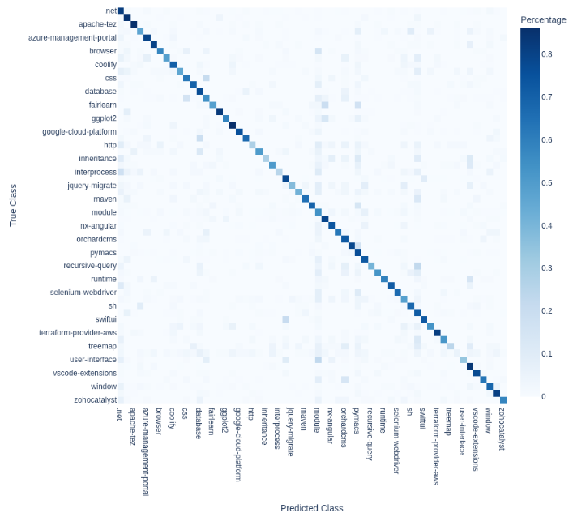

# The Experiments

##  Tag Prediction

The primary classification goal was to predict the appropriate semantic tag centroid(s) for a given question using its 4096-dimensional title and body embeddings.

### XGBoost Baseline

As a baseline, an XGBoost model was trained on question body embeddings. To simplify the initial evaluation, the inherently multi-label task was reduced to a multiclass classification problem. The target for each question was mapped to a single label via a majority vote mechanism, selecting the centroid (or tag group) containing the highest frequency of the question’s original tags.

This XGBoost model trained for 599 minutes. It achieved a **Weighted F1 Score of 0.6882** (and accuracy of 0.6928). The limitation of this approach was its inability to effectively model the complex, non-linear semantic interactions embedded in the 4096-dimensional vectors, forcing it to treat the dimensions largely independently. Nevertheless, this result provided a solid benchmark for subsequent deep learning models.

{#fig:xgboost-cm width=100%}

### Neural Network Architectures

<!-- @NOTE: finished here -->

Neural Networks (NNs) were adopted to natively support multi-label output and leverage advanced techniques like Attention Mechanisms.

#### Simple MLP Baseline

A basic Multi-Layer Perceptron (MLP) trained on the question body embeddings with `BCEWithLogitsLoss` achieved a weighted F1 score of approximately 0.6790. This confirmed the need for richer architectures that could utilize both title and body context simultaneously.

#### Dual-Stream Fusion Network (DSF)

The DSF models used dual streams to process Title embeddings and Body embeddings separately before combining them.

1.  **DSF with Multi-Head Self-Attention (MHSA):**
    *   This initial fusion mechanism involved concatenating the processed embeddings and applying MHSA, inspired by multi-modal classification work.
    *   Initial training suffered from rapid overfitting. This was mitigated by applying a higher Dropout rate (0.5), switching to the AdamW optimizer (decoupling weight decay for better generalization), and adopting **Asymmetric Loss (ASL)**.
    *   **ASL** was critical for addressing the class imbalance inherent in multi-label classification (where most labels are negative for any sample). ASL uses focusing parameters ($\gamma_-=4, \gamma_+=1$) to aggressively down-weight easy negative examples, forcing the model to focus on the difficult ones and on positive examples.
    *   Result: **F1 Weighted 0.7110**.

2.  **DSF with Cross-Attention Fusion (Optimal Model):**
    *   To further combat overfitting and improve feature interaction, the MHSA was replaced with **Cross-Attention**, allowing the typically concise **Title embedding to "query" the verbose Body embedding** to extract relevant features.
    *   Additional regularization, **Manifold Mixup**, was applied to the embeddings during training to encourage smoother decision boundaries in the latent space.
    *   Trained over 100 epochs (~60 minutes) using OneCycleLR scheduling, this model achieved the best outcome: **F1 Micro 0.7253** and **F1 Weighted 0.7196**.

| **Table 2: Summary of Tag Prediction Results (Weighted F1 Score)** |
| :--- | :---: |
| **Model** | **F1 Score (Weighted)** |
| XGBoost (Multiclass Approximation) | 0.6882 |
| Baseline MLP | 0.6790 |
| DSF with MHSA Fusion | 0.7110 |
| **DSF with Cross-Attention Fusion** | **0.7196** |

### Attention Analysis Visualization

Post-training analysis included visualizing the internal workings of the Cross-Attention mechanism to understand how the 8 attention heads weighted the relationship between the Title and Body embeddings for specific samples. This visualization provided diagnostic insight into the model's decision process (Figures 9 and 10).

| **Figure 9: Cross-Attention Alignment per Head (Sample #0)** | **Figure 10: Cross-Attention Alignment per Head (Sample #2)** |
| :---: | :---: |
| @TODO: Insert Figure: Cross-Attention Alignment per Head (Sample #0) (Source:) | @TODO: Insert Figure: Cross-Attention Alignment per Head (Sample #2) (Source:) |

##  Score Prediction

The goal was to predict the raw integer question score using only the embedded textual content (regression task). This task was inherently challenging due to the high variance and sparse nature of scores (mean score of 23.55, but max score of 27,487, with most scores clustered near zero).

### Baseline Comparison (Traditional ML vs. Embeddings)

An initial exploration using traditional feature extraction (TF-IDF) and statistical dimensionality reduction (Truncated SVD, a form of Latent Semantic Analysis) provided a challenging context for the deep learning models:
*   The mean baseline achieved an $R^2$ of $-0.000196$ (Test RMSE 149.97).
*   The best traditional model, **TF-IDF + SVD + Ridge**, managed a Test $R^2$ of **0.0074** (Test RMSE 275.05) on the raw score target. This low $R^2$ score reinforced the difficulty of explaining score variance using extracted features alone.

### Deep Learning Regressors

Single-stream MLPs (using only Title or Body embeddings) and the dual-stream DSF architectures (MHSA and Cross-Attention variants) were adapted for regression using Mean Squared Error (MSE) loss. The input features included the embeddings and a normalized tag count feature (clipped to).

All deep learning models significantly outperformed the traditional mean baseline ($R^2 \approx 0.000$).

| **Table 3: Score Regression Performance on Test Set (using Embeddings)** |
| :--- | :---: | :---: | :---: |
| **Model** | **Input** | **Test RMSE** | **Test R²** |
| **DSF-MHSA Regressor** | Title + Body Embeddings | 134.24 | **0.199** |
| DSF-CrossAttention Regressor | Title + Body Embeddings | 135.27 | 0.186 |
| Body MLP | Body Embedding Only | 137.57 | 0.158 |
| Title MLP | Title Embedding Only | 138.73 | 0.144 |
| Mean Baseline | Constant | 149.97 | 0.000 |

The **DSF-MHSA Regressor** achieved the highest performance, explaining approximately **19.9%** of the score variance on the test set. Diagnostic analysis showed that predictions tended to cluster accurately near zero/low scores, but the model struggled significantly to predict high scores correctly (Figure 11).

| **Figure 11: Predicted vs Actual Scores (DSF-MHSA, Filtered Range)** | **Figure 12: Residual Distribution (DSF-MHSA, Filtered Range)** |
| :---: | :---: |
| @TODO: Insert Figure: Predicted vs Actual Scores (DSF-MHSA, Filtered to <200) (Source: or) | @TODO: Insert Figure: Residual distribution (DSF-MHSA, Filtered to <200) (Source: or) |
