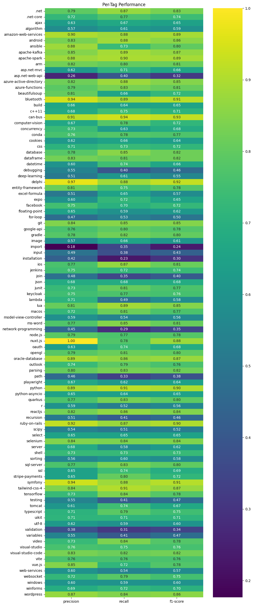
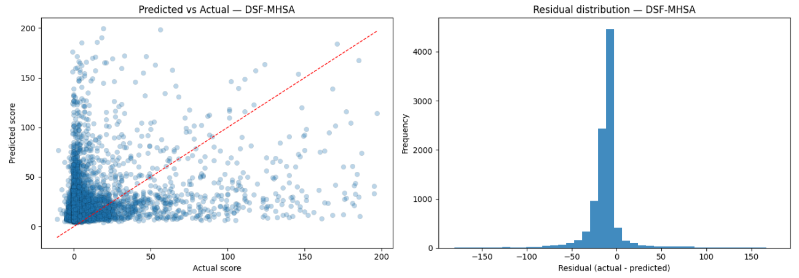

# The Experiments

##  Tag Prediction

The primary classification goal was to predict the appropriate semantic tag centroid(s) for a given question using its 4096-dimensional title and body embeddings.

### XGBoost Baseline

As a baseline, an XGBoost model was trained on question body embeddings. To simplify the initial evaluation, the inherently multi-label task was reduced to a multiclass classification problem. The target for each question was mapped to a single label via a majority vote mechanism, selecting the centroid (or tag group) containing the highest frequency of the question’s original tags.

This XGBoost model trained for 599 minutes. It achieved a **Weighted F1 Score of 0.6882** (and accuracy of 0.6928). The limitation of this approach was its inability to effectively model the complex, non-linear semantic interactions embedded in the 4096-dimensional vectors, forcing it to treat the dimensions largely independently. Nevertheless, this result provided a solid benchmark for subsequent deep learning models.

{#fig:xgboost-cm width=100%}

### Neural Network Architectures

To improve baseline performance, several neural network architectures were explored to better capture the semantic relationships in the embeddings and to natively handle the multi-label nature of the task.

#### Simple MLP Baseline

A basic Multi-Layer Perceptron (MLP) trained on the question body embeddings with `BCEWithLogitsLoss` achieved a weighted F1 score of approximately **0.6790**. This confirmed the need for richer architectures that could utilize both title and body context simultaneously.

#### Dual-Stream Fusion Network (DSF)

The DSF models used dual streams to process Title embeddings and Body embeddings separately before combining them.

1.  **DSF with Multi-Head Self-Attention (MHSA):**
    *   This initial fusion mechanism involved concatenating the processed embeddings and applying MHSA, inspired by multi-modal classification work.
    *   Initial training suffered from rapid overfitting. This was mitigated by applying a higher Dropout rate (0.5), switching to the AdamW optimizer (decoupling weight decay for better generalization), and adopting **Asymmetric Loss (ASL)**.
    *   **ASL** was critical for addressing the class imbalance inherent in multi-label classification (where most labels are negative for any sample). ASL uses focusing parameters ($\gamma_-=4, \gamma_+=1$) to aggressively down-weight easy negative examples, forcing the model to focus on the difficult ones and on positive examples.
    *   Result: **F1 Weighted 0.7110**.

2.  **DSF with Cross-Attention Fusion (Optimal Model):**
    *   To further combat overfitting and improve feature interaction, the MHSA was replaced with **Cross-Attention**, allowing the typically concise **Title embedding to "query" the verbose Body embedding** to extract relevant features.
    *   Additional regularization, **Manifold Mixup**, was applied to the embeddings during training to encourage smoother decision boundaries in the latent space.
    *   Trained over 100 epochs (~60 minutes) using OneCycleLR scheduling, this model achieved the best outcome: **F1 Micro 0.7253** and **F1 Weighted 0.7196**.

{#fig:dsf-performance height=95%}

### Summary of Results

As shown in [@tbl:tag-prediction-results], the DSF with Cross-Attention Fusion outperformed all other models, demonstrating the effectiveness of attention-based fusion and advanced loss functions in multi-label tag prediction tasks.

| **Model** | **F1 Score (Weighted)** |
| :--- | :---: |
| XGBoost (Multiclass Approximation) | 0.6882 |
| Baseline MLP | 0.6790 |
| DSF with MHSA Fusion | 0.7110 |
| **DSF with Cross-Attention Fusion** | **0.7196** |

Table: Summary of Tag Prediction Results. {#tbl:tag-prediction-results}

The final model mainly has trouble with tags like "import," "installation," and "validation," which probably suggests that it is difficult to distinguish between common technical noise and particular topical intent. The Asymmetric Loss (ASL) may have over-suppressed terms like "import" as "easy negatives" because they appear as boilerplate in nearly every code snippet. Furthermore, the model's inability to handle specialized tags like "asp.net-web-api" indicates that the Cross-Attention mechanism may occasionally lack a detailed enough Title "Query" to extract particular nuances from the verbose Body text.

<!-- 
### Attention Analysis Visualization

Post-training analysis included visualizing the internal workings of the Cross-Attention mechanism to understand how the 8 attention heads weighted the relationship between the Title and Body embeddings for specific samples. This visualization provided diagnostic insight into the model's decision process (Figures 9 and 10).
 -->

##  Score Prediction

Our secondary regression task focused on predicting the question score, which reflects community engagement and perceived quality.
The goal was to predict the raw integer question score using only the embedded textual content (regression task). This task was inherently challenging due to the high variance and sparse nature of scores (mean score of 23.55, but max score of 27,487, with most scores clustered near zero).

### Traditional ML Baseline 

To establish a performance floor, we conducted an initial exploration using traditional NLP techniques, combining TF-IDF feature extraction with Truncated SVD (Latent Semantic Analysis) for dimensionality reduction. We benchmarked several configurations, including:

- Linear Models: TF-IDF (with variations in n-grams and stemming) paired with Ridge Regression.
- Ensemble Methods: Gradient Boosting (GBR) utilizing TF-IDF, SVD, and engineered "extra features."
- Baseline Comparisons: Standard Bag-of-Words (BoW) and a simple mean-prediction baseline.

The results were underwhelming:

*   The mean baseline achieved an $R^2$ of $-0.000196$ (Test RMSE 149.97).
*   The best traditional model, **TF-IDF + SVD + Ridge**, managed a Test $R^2$ of **0.0074** (Test RMSE 275.05) on the raw score target. 

This near-zero R2 score underscores the inherent difficulty of the task: traditional frequency-based features are insufficient for capturing the complex, non-linear relationships that drive community engagement (scores) on Stack Overflow. This served as a strong justification for moving toward the deep learning approaches detailed below.

### Deep Learning Regressors

To evaluate the predictive power of neural architectures on numerical outcomes, we adapted the single-stream MLPs and the dual-stream DSF variants for regression by utilizing a Mean Squared Error (MSE) loss function. In addition to the semantic embeddings, we integrated a normalized, clipped tag count feature to provide the model with a proxy for question complexity.

As shown in [@tbl:score-regression-results], all deep learning configurations achieved a substantial performance leap over the traditional baselines ($R^2 \approx 0.000$).

| **Model** | **Input** | **Test RMSE** | **Test R²** |
| :--- | :---: | :---: | :---: |
| Mean Baseline | Constant | 149.97 | 0.000 |
| Title MLP | Title Embedding Only | 138.73 | 0.144 |
| Body MLP | Body Embedding Only | 137.57 | 0.158 |
| DSF-CrossAttention Regressor | Title + Body Embeddings | 135.27 | 0.186 |
| **DSF-MHSA Regressor** | Title + Body Embeddings | 134.24 | **0.199** |

Table: Score Regression Performance on Test Set (using Embeddings). {#tbl:score-regression-results}

The DSF-MHSA Regressor emerged as the top performer, explaining approximately 19.9% of the score variance. Interestingly, in the regression context, the global focus of Multi-Head Self-Attention (MHSA) slightly outperformed the more targeted Cross-Attention mechanism.

Despite the improvement, diagnostic analysis revealed a common challenge in social data regression: while the model accurately predicts the vast majority of low-scoring posts, it struggles to capture the "viral" outliers or high-score peaks (@fig:scores-pred-actual). This suggests that high scores may be driven by external temporal factors or community dynamics not fully captured within the text embeddings alone.

{#fig:scores-pred-actual width=100%}
