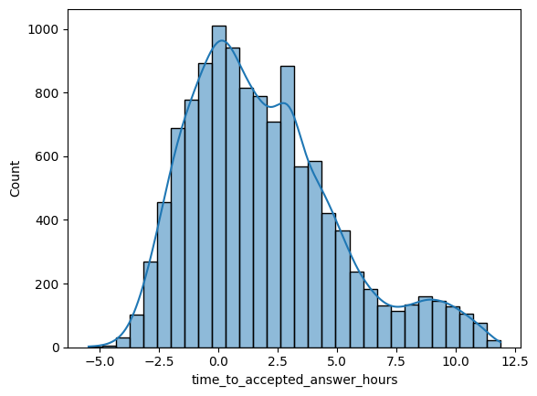
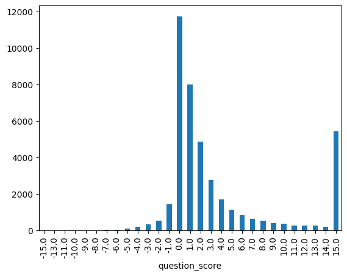
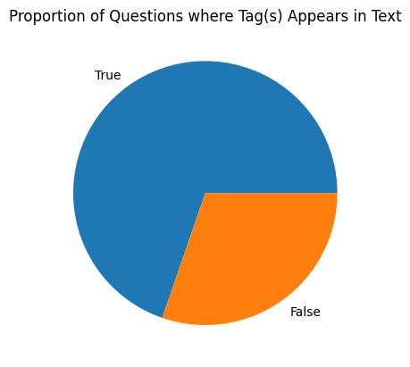

# EDA

## Overview

- As of now, we have collected a dataset containing 100,000 questions from StackExchange (specifically StackOverflow), along with their associated metadata. 

---

- As stated earlier, the dataset has the following features:

| #  | Column                         | Dtype    |
|----|--------------------------------|----------|
| 0  | title                          | object   |
| 1  | has_accepted_answer            | bool     |
| 2  | accepted_answer_score          | float64  |
| 3  | time_to_accepted_answer_hours  | float64  |
| 4  | question_score                 | int64    |
| 5  | question_text                  | object   |
| 6  | num_tags                       | int64    |
| 7  | tags                           | object   |
| 8  | accepted_answer_id             | float64  |
| 9  | accepted_answer_length_chars   | float64  |
| 10 | accepted_answer_length_tokens  | float64  |

---

### Deduplication

- Out of these questions, 8 were dropped for being duplicates.

### Acceptance Analysis

- From those remaining, 39938 questions have an accepted answer, while 60054 do not.
- Interestingly, out of those accepted answers, only 12000 have `time_to_accepted_answer_hours` defined (i.e., non-null values).

## Time to Accepted

{ height=80% }

---

{ height=80% }


## Tags

- The dataset contains a total of $7684$ unique tags. The most common being:

| Tag         | Count  |
|-------------|--------|
| python      | 1528   |
| c#          | 746    |
| javascript  | 703    |
| c++         | 689    |
| java        | 592    |

## Extreme Multi-Label Classification

- Since we are dealing with such a vast number of different tags, we propose the following approaches to investigate:

1. Frequency-Based Filtering
    - Aside from the top `N` most common tags, one approach could limit the scope to a subset of tags relevant to our analysis
        – e.g. **top N programming languages**

2. "Semantic Clustering":
    - Use pre-trained embeddings to represent question descriptions in a vector space.
    - Apply clustering algorithms to group similar questions together based on their embeddings.

## Tags EDA

{ height=80% }

---

We filtered the tags using the list of programming languages (from Wikipedia) and selected the most frequent ones:

```
['python', 'javascript', 'java', 'c#', 'php', 'html', 'c++', 'css', 'r']
```

**Key observations about the resulting subset:**

- **Subset size:** `42,037` questions
- **Class balance:** The distribution across these languages is relatively balanced (see last plot), and can be further balanced if needed.
- **Multi-label cases:** Some questions are tagged with multiple programming languages.

---

**Distribution of programming language tags per question:**

| # Tags | # Questions |
|--------|-------------|
|   1    |   38,547    |
|   2    |    3,015    |
|   3    |     464     |
|   4    |      11     |

## Score

- Finally, we analyzed the distribution of the scores of the questions in the dataset (already of the selected programming-language-tagged subset).

{ height=75% }

---

Based on the hisogram, we proposed the following score classes:

{ height=85% }

---

{ height=80% }

## Conclusions

- the data about the accepted answer is provided for only small fraction of the data.
- there are too many tags to perform the classification using all of them
- however, we can choose a certain subset (e.g. most popular programming languages) and focus on it
- we can also try to predict the class of the score of the answer (integer score mapped to classes of uneven frequencies)
