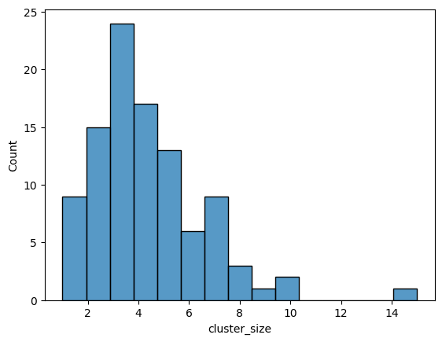

# TAG 2

## Recap

- Problem: 22,753 unique tags is too large for direct multi-label classification.
- Solution: Reduce tags to 100 clusters using *Recursive Spherical K-Means* (with cosine similarity), then classify into these clusters.

## Reduction & Baseline

- Our dataset has $100$k records many of which have multiple tags.
- The idea is that we can remove tags with low frequency and remove records that become tag-less after this operation.
- Aforementioned reduction for the threshold of $100$ resulted in $90,205$ records and $411$ unique tags.

{ height=50% }

---

- With the resulting tags, we performed Recursive Spherical K-Means to reduce the $411$ tags to $100$ centroids.
- The outlier with $15$ tags corresponds to a cluster with following tags:
`database`, `mongodb`, `sql`, `elasticsearch`, `firebase`, `postgresql`, `sqlite`, `mysql`, `jdbc`, `supabase`, `sql-update`, `redis`, `hibernate`, `sqlalchemy`, `snowflake-cloud-data-platform`

{ height=50% }

---

- For the $9787$ orphan tags (those with insufficient frequency), we assigned them to the nearest centroid based on cosine similarity of their embeddings.
- For example:

```python
closest_centroid_tag(tags,centroid_tags, 'ntp')
('datetime', np.float64(0.8098148848579392))
```

- This resulted in the final set of $100$ centroids covering all $22,753$ original tags, without losing any data.


## Why Neural Networks?

1.  **Multi-Label Classification:** NNs naturally handle multi-label outputs (e.g., using Sigmoid activations + BCE Loss).
2.  **Feature Interaction:** Deep learning models can learn complex non-linear interactions between Title and Body embeddings.
3.  **Custom Loss Functions:** Easier to implement losses like Asymmetric Loss to handle class imbalance.

