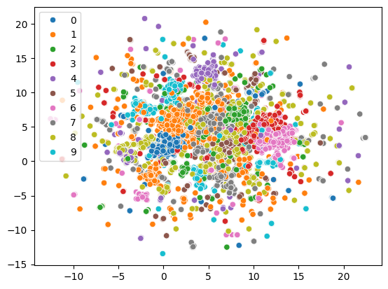
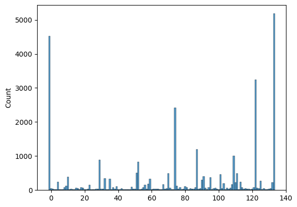
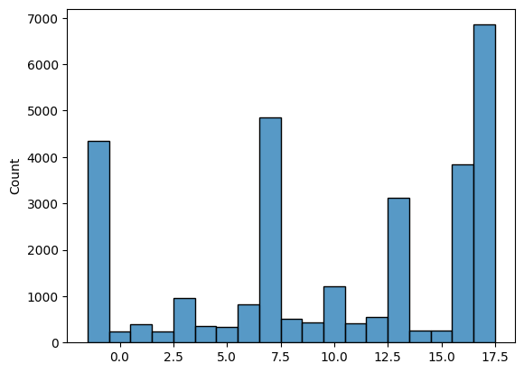
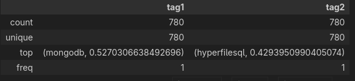
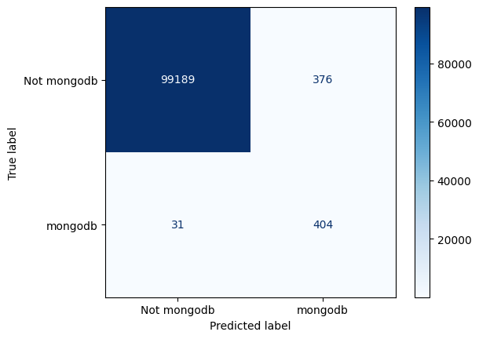

# TAG Embeddings

## Initial problem

- Having 22753 unique tags poses a significant problem for our dataset,
- each questions can have multiple tags (for example `python`,`pandas`,$\ldots$)

## Embeddings

- We've decided to embed tags, as well as question texts using `qwen3-embedding:8b` model, translating each tag into a $4096$ vector.
- This resulted in a dataframe of shape `22753x4096` vector, which introduced more issues:
    - Lack of memory to process this data (the dtype is `f64`)
    - Too large dimensions

---

{ height=85% }

## Dimensionality reduction

- Initial approach considered `HDBSCAN` (Hierarchical Density-Based Spatial Clustering of Applications with Noise), but due to memory required to perform this operation (over 64GB of RAM)
- Later on we've moved to a `Birch` algorithm, with `HDBSCAN` as well as `AgglomerativeClustering` which got unsatisfactory results

## UMAP

- After reading forums, we've decided to try `UMAP` (Uniform Manifold Approximation and Projection) which sounded ideal for our problem, since it can be used for general non-linear dimension reduction.

{ height=60% }

---

{ height=80% }

---

{ height=80% }

---

## Optuna

- A hyperparameter optimization framework which we hoped would find optimal parameters for our dimensionality reduction task.
- We need a score which we can maximize/minimize during dimension reduction:
    - Caliński-Harabasz index
        - ratio of the between-cluster separation to the within-cluster dispersion, normalized by their number of degrees of freedom.
    - Silhouette score
    - Cluster persistence
        - stability of each cluster, indicating well-defined grouping

## UMAP Optimization

- UMAP coupled with HDBSCAN
- Optimized hyperparameters:
    - `umap_n_components`
    - `umap_n_neighbors`
    - `umap_min_dist`
    - `umap_metric`
    - `hdb_min_cluster_size`
    - `hdb_min_samples`
    - `hdb_cluster_selection_method`
    - `hdb_cluster_selection_epsilon`

---

{ height=80% }

---

{ height=80% }

## Conclusions

- We have to find better approach
- Possible culprits:
    - For UMAP to work as intended 'The data must be uniformly distributed on Riemannian manifold'
    - additionally 'The Riemannian metric is locally constant (or can be approximated as such)'
        - embeddings generally create spaces with varying local geometry depending on the semantic density of the training data.
    - Too few optimization runs.

## Recursive Embedding and Clustering

- Based on [Spotify's](https://engineering.atspotify.com/2023/12/recursive-embedding-and-clustering) blog.

](img/REaC.png){height=50%}

## Recursive KMEANS clustering

- Since properly implementing HDBSCAN in the context of our problem is still a standing question, we've decided to use `KMEANS`.
- Initially, we've specified the clustering hierarchy structure `100,100`.
- After finding those centroids, we've taken their mean embeddings and selected 'most descriptive' tags for each cluster (based on cosine/euclidean metric).
- euclidean metric worked 'better' in the case of KMEANS.

{ height=40% }

## Recursive Spherical KMEANS clustering

- Since spherical KMEANS is better suited for cosine similarity and for text data in general, we've decided to try it as well. Based on a Accelerating Spherical k-Means papaer [@Schubert_2021].

{ height=40% }

## Results

- To verify the quality of new clusters, we've used a very basic predictor based on the dot product of normalized question embeddings and tag cluster embeddings.
    - We've taken 2 most similar clusters for each question.

{ height=60% }

---

{ height=35% }

---

{ height=80% }