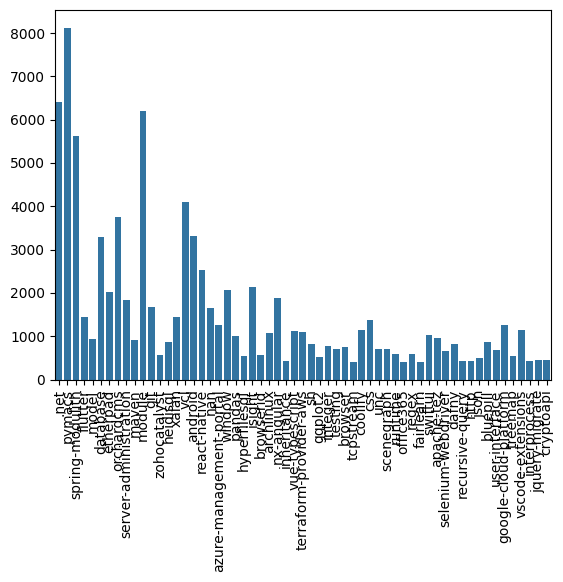
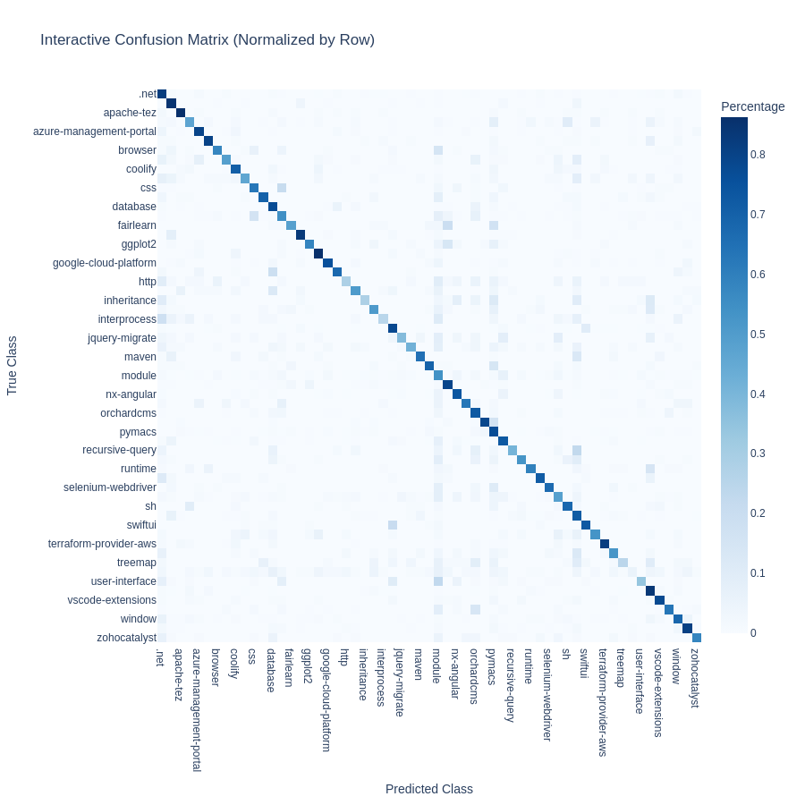

# Tag Prediction

## XGBoost "Baseline"

- XGBoost stands for "Extreme Gradient Boosting", where the term "Gradient Boosting" originates from the paper *Greedy Function Approximation: A Gradient Boosting Machine*, by Friedman.
- It is an ensemble learning method that builds multiple weak learners (decision trees) sequentially, where each tree attempts to correct the errors of the previous ones.

- Task: **predict the question's centroid tag based on question text embedding**.

---

- Our questions still have multiple tags, which drastically complicates the problem.
    - To solve this, we first took the original tags of each question, mapped them to their respective centroids, and selected the "best" centroid (the one with the most original tags assigned to it) as the target label.

{ height=55% }

---

- To combat the unbalanced distribution of centroid tags, we applied class weights inversely proportional to their frequencies during training, using `sklearn.utils.class_weight.compute_class_weight` and passing these weights to XGBoost's `scale_pos_weight` parameter.
 - Learning process took $599$ minutes.
- Accuracy: $0.6928123848138592$
- F1 Weighted: $0.6882358640179885$

---

{ height=90% }

## Limitations of XGBoost Approach

## Pytorch

- For better modeling of the multi-label nature of the problem, we turned to Neural Networks using PyTorch.
- We can easily design architectures for multi-label classification and implement custom loss functions to handle class imbalance.
- We can levarage **Attention Mechanisms** and other fancy architectures for our predictive model.

## Baseline: Simple MLP

- Architecture:
```python
BaselineNetwork(
    (fc1): Linear(in_features=4096, out_features=2048)
    (relu): ReLU()
    (dropout): Dropout(p=0.3)
    (fc2): Linear(in_features=2048, out_features=1024)
    (dropout2): Dropout(p=0.3)
    (fc3): Linear(in_features=1024, out_features=100)
)
```

- Input: `question_text_embedding`
- Loss: `BCEWithLogitsLoss`
    - Since question can have a very popular, and very rare tag (e.g. `.net`, `nvim`), we can't just weigh all tags equally. Instead, we will penalize by `BCEWithLogitsLoss` for missing a rare tag much more heavily than for missing a popular tag.

---

- Training:
    - 50 epochs ~6 minutes
    - F1 (weighted): $\approx 67.9\%$

- Properly models multi-label outputs (unlike a multiclass XGBoost mapping)
- Low compute and quick iteration for ablations
- Slightly underperforms XGBoost baseline on this dataset, but performs multi-label classification instead of basic classification.

---

{ height=90% }


## Per-Tag Performance: Python

{ height=80% }

## Attention-Based Models

- Inspired by 'Dual-stream fusion network with multi-head self-attention for multi-modal fake news detection' [@YANG2024112358].
- Instead of processing text and images as in the paper above, we will map two streams:
    - question_text embeddings,
    - title embeddings,
- and fuse them using multi-head self-attention to capture correlation between the two modalities.
- As a fusion, we will use the paper's proposed MHSA Fusion strategy to let the Title "attend" to the question body and vice versa.

## Dual Stream Fusion Network (DSF)

- Process Title and Body separately and fuse them.
- **Architecture:**
    - **Stream 1:** Title Embedding -> Projection -> LayerNorm
    - **Stream 2:** Body Embedding -> Projection -> LayerNorm
    - **Fusion:** Multi-Head Self-Attention (MHSA) on stacked features.
- Since the shape of both embeddings is the same, we have the same architecture for both streams:

```python
(title_proj): Sequential(
    (0): Linear(in_features=4096, out_features=1024, bias=True)
    (1): LayerNorm((1024,), eps=1e-05, elementwise_affine=True)
    (2): GELU(approximate='none')
    (3): Dropout(p=0.1, inplace=False)
```

---

- The initial results were disappointing- model overfitted very quickly and proved immediately useless on validation set.
- To mitigate overfitting, we:
    - Increased dropout rate from 0.1 to 0.5.
    - Changed optimizer from Adam to AdamW.
        - AdamW decouples weight decay from the gradient update, leading to better generalization.
    - Implemented **Asymmetric Loss** [@benbaruch2021asymmetriclossmultilabelclassification] to handle label imbalance.

## Asymmetric Loss (ASL)

-  In multi-label classification with 100 classes, for any given question, most labels are **Negative**. The model can get high accuracy by just predicting "0" for everything.
- To counter this, ASL:
    - Separates the treatment of positive and negative samples.
        - Applies different focusing parameters to down-weight easy negatives more aggressively.
        - Keeps the weight high for positive samples to ensure they are learned well.
    - Focuses training on hard negatives and positive samples.
    - Essentially, mistakes on positives matter more than mistakes on easy negatives (based on the probability score output by the model).
- Parameters: $\gamma_- = 4$, $\gamma_+ = 1$.

## Training

- Aside from the loss function, we've added:
    - ReduceLROnPlateau scheduler to reduce learning rate on validation F1 plateau.
    - As earlier mentioned, AdamW optimizer with weight decay of 1e-2.
- Training for 50 epochs took ~20 minutes.
- F1 score (micro) on validation: 0.713
- F1 score (weighted) on validation: 0.711

---


{ height=90% }


## Dual Stream Fusion with Cross-Attention

- Some sort of overfitting still occurred, so we tried replacing the MHSA fusion with Cross-Attention:
    - Instead of both streams attending to each other equally, we let the Title embedding "query" the Body embedding.
- Intuition:
    - *"Given this Title, which parts of the Body Embedding are relevant?"*
    - Title is short and dense with information.
    - Body is longer and more verbose.
    - Letting Title attend to Body helps focus on relevant parts of the Body text.
- Same as before, we used ASL loss to combat label imbalance. This time with $\gamma_- = 2$, $\gamma_+ = 1$.
- To further reduce overfitting, we also applied Manifold Mixup on the embeddings:
    - It creates new training samples by interpolating between the embeddings (and tags) of random pairs.
    - Enforces smoother decision boundaries in the latent space, improving generalization.

## Training

- Training for 100 epochs took ~60 minutes.
- Used `OneCycleLR` scheduler.
- Implemented basic Curriculum Learning by starting with smaller dropout (0.25)
- F1 score (micro) on validation: $0.725291274763489$
- F1 score (weighted) on validation: $0.7196345470456641$

---

{ height=90% }

## Summary of Results

| Model                          | F1 (weighted) |
|--------------------------------|----------------|
| XGBoost                        | 0.6882         |
| Baseline MLP                   | 0.6790         |
| DSF with MHSA Fusion           | 0.7110         |
| DSF with Cross-Attention Fusion | 0.7196         |